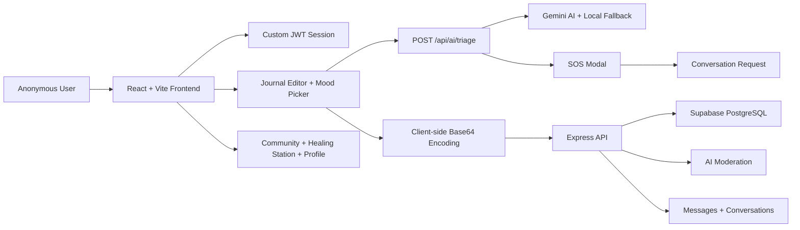

# An Nhiên

> **A Vietnamese-first mental health companion for anonymous journaling, AI risk triage, SOS escalation, community support, and guided healing content.**

An Nhiên is built for one fragile moment: when a young person feels overwhelmed but is not ready to talk to anyone yet.

Instead of starting with a login wall, a diagnosis form, or a cold chatbot, An Nhiên begins with a soft anonymous onboarding, a private journal, a breathing ritual, and a safety-aware AI layer that can detect high-risk language and route the user toward human support.

This repository is a full-stack hackathon MVP: **React/Vite frontend**, **Express/TypeScript backend**, **Supabase PostgreSQL**, **Gemini AI**, **custom JWT auth**, and a tested API contract.

---

## Why This Project Matters

Most mental-health apps either become generic mood trackers or isolated chatbots. An Nhiên is designed as a **safety ecosystem**:

- **Private first**: anonymous nickname-based onboarding and client-side journal encoding for the MVP.
- **AI where it matters**: Gemini is used for triage, moderation, and empathetic persona replies, not as a gimmick.
- **Escalation ready**: high-risk journal content triggers an SOS modal with hotline actions and a route into a support conversation.
- **Human-in-the-loop**: healer, doctor, and admin roles are modeled in the product architecture.
- **Community with guardrails**: public sharing is moderated before it becomes harmful.

The goal is not to replace therapy. The goal is to catch distress earlier, lower the barrier to asking for help, and give a safer path from private expression to real support.

---

## MVP At A Glance

| Area | What It Does |
|---|---|
| Anonymous onboarding | Creates a nickname-based user session with JWT, no email required for the MVP user flow. |
| Mood + journal | Lets users choose one of five moods and write a text-only journal. |
| AI triage | Sends journal plaintext to backend AI triage before saving, detecting low/medium/high risk. |
| SOS modal | Shows warm emergency guidance, Vietnam hotline links, and a button to connect with a companion. |
| Client-side journal encoding | Encodes journal text client-side before sending `encryptedContent` to the backend. |
| Mood dashboard | Builds a simple mood distribution chart from journal metadata. |
| Community | Anonymous sharing flow with AI moderation and admin review paths. |
| Chat | Conversation/message APIs with optional Gemini AI persona reply. |
| Healing station | Video-based healing content surface for breathing, grounding, and psychoeducation. |
| Staff portal | Doctor, healer, and admin routing are modeled for role-based workflows. |

---

## Demo Story For Judges

Use this sequence when presenting the project:

1. **Anonymous start**  
   A user enters An Nhiên with only a nickname and selected stress topics.

2. **Gentle home screen**  
   The home screen greets the user personally and shows a breathing circle before journaling.

3. **Normal journaling**  
   The user writes a regular entry. AI triage returns safe/medium risk, then the journal is encoded client-side and stored.

4. **High-risk journaling**  
   The user writes something like "mình muốn biến mất" or "muốn reset game". Gemini/local fallback triage marks the content as high-risk.

5. **SOS escalation**  
   An Nhiên opens the SOS modal with hotline actions and a button to connect to a companion.

6. **Human support path**  
   The SOS button attempts to create a conversation and routes the user to the messaging screen.

7. **Admin/community safety**  
   Community posts can be moderated and flagged instead of blindly published.

This demo shows the core idea clearly: **private reflection → AI safety check → encoded storage or SOS escalation → human support path**.

---

## System Architecture



---

## Tech Stack

| Layer | Stack |
|---|---|
| Frontend | React 19, Vite 8, React Router, Tailwind CSS 4, Lucide React, Font Awesome |
| Backend | Express 4, TypeScript, Zod, JWT, bcryptjs |
| AI | Google Gemini via `@google/generative-ai`, with local fallback heuristics |
| Database | Supabase PostgreSQL |
| Auth | Custom JWT for anonymous users and staff roles |
| Testing | Node built-in test runner, TypeScript build checks, API smoke tests |
| Tooling | Vite, oxlint, ts-node-dev |

---

## Repository Structure

```text
an_nhien/
├── backend/
│   ├── src/
│   │   ├── controllers/        # Request handlers
│   │   ├── routes/             # Express route groups
│   │   ├── services/           # Domain logic + Gemini integration
│   │   ├── validations/        # Zod request schemas
│   │   ├── middleware/         # Original auth/error middleware
│   │   ├── middlewares/        # Enterprise-style middleware layer
│   │   ├── lib/                # Supabase, Gemini, HTTP helpers
│   │   ├── utils/              # JWT, response, logger, crypto helpers
│   │   └── index.ts            # API entry point
│   ├── supabase/
│   │   ├── migrations/         # Supabase migration files
│   │   └── seed.sql            # Seed data
│   └── test/                   # Backend unit, smoke, contract tests
│
├── frontend/
│   ├── src/
│   │   ├── components/
│   │   │   ├── features/       # JournalEditor
│   │   │   ├── layout/         # Sidebar, bottom nav, main layout
│   │   │   └── ui/             # SOSModal
│   │   ├── lib/                # API client, auth, crypto, moods
│   │   ├── pages/              # Home, Messages, Community, HealingStation, Profile, Admin
│   │   ├── App.jsx             # Router + role guards
│   │   └── index.css           # Design system + breathing animation
│   └── test/                   # Frontend journal/mood contract tests
│
├── api-contract.md             # Frontend/backend API source of truth
├── database.sql                # Base Supabase schema
├── seed.sql                    # Root seed data
├── steps-mvp/                  # MVP build prompts and implementation steps
└── steps-add/                  # Extended production feature plans
```

---

## Core AI Flows

### 1. Journal Risk Triage

```text
User writes journal text
→ frontend sends plaintext to POST /api/ai/triage
→ backend asks Gemini for riskLevel, mood, triggerSOS, suggestedResponse
→ if high risk: frontend opens SOS modal
→ if safe: frontend encodes journal text and saves via POST /api/journals
```

Important privacy note: for the MVP, AI triage reads the plaintext journal **before** storage so the system can detect urgent self-harm risk. The stored journal content is client-side encoded before being sent as `encryptedContent`.

### 2. Community Moderation

```text
User creates anonymous post
→ backend checks local unsafe patterns
→ Gemini moderation can classify content as safe, flagged, or blocked
→ flagged content can trigger SOS and admin review
```

### 3. AI Persona Chat

```text
User sends message
→ backend can request Gemini reply using a healer persona
→ fallback response is used if Gemini is unavailable
→ messages are saved as text-only records
```

---

## Safety And Privacy Model

| Decision | Current MVP Behavior |
|---|---|
| Anonymous user identity | Nickname + JWT, no required email in user onboarding. |
| Journal storage | Journal body is client-side Base64 encoded before storage. |
| AI triage | Plaintext is sent to backend AI triage before saving to catch high-risk content. |
| Journal listing | `/api/journals/me` returns metadata only; detail is fetched per journal. |
| SOS support | High-risk content opens an SOS modal with hotline links and conversation routing. |
| Media safety | Journal and messages are text-focused; no image/file upload path is required for journal safety flow. |
| Medical boundary | The app does not diagnose. It offers support, triage, and escalation guidance. |

Production upgrade path: replace Base64 with Web Crypto AES-GCM using a user PIN-derived key, add audit logs, formal crisis resources by region, and stricter data-retention policies.

---

## API Highlights

| Method | Endpoint | Purpose |
|---|---|---|
| `GET` | `/api/health` | Backend health check |
| `POST` | `/api/auth/setup` | Anonymous user onboarding |
| `POST` | `/api/auth/login` | Staff login |
| `GET` | `/api/auth/me` | Current user profile |
| `POST` | `/api/journals` | Save encoded journal |
| `GET` | `/api/journals/me` | Journal metadata list |
| `GET` | `/api/journals/:id` | Journal detail for client-side decode |
| `POST` | `/api/ai/triage` | Journal risk analysis |
| `POST` | `/api/ai/chat` | AI persona response |
| `POST` | `/api/posts` | Create moderated community post |
| `GET` | `/api/posts` | Public community feed |
| `POST` | `/api/conversations` | Start support conversation |
| `POST` | `/api/messages` | Send message / optional AI reply |
| `GET` | `/api/videos` | Healing station videos |

See [`api-contract.md`](./api-contract.md) for the full contract.

---

## Database Schema

The Supabase schema is centered around seven core tables:

| Table | Purpose |
|---|---|
| `users` | Anonymous users, healers, doctors, admins |
| `journals` | Encoded private journal entries + mood metadata |
| `posts` | Anonymous community posts |
| `post_reactions` | Hug, empathy, peace reactions |
| `conversations` | User-to-healer/doctor support sessions |
| `messages` | Text-only conversation history |
| `videos` | Healing station video metadata |

Run [`database.sql`](./database.sql) or the Supabase migrations in [`backend/supabase/migrations`](./backend/supabase/migrations).

---

## Getting Started

### Prerequisites

- Node.js 18+
- npm 9+
- Supabase project
- Gemini API key from Google AI Studio

### 1. Clone

```bash
git clone https://github.com/suzynotsusie/annhien.git
cd annhien
```

### 2. Configure Backend Environment

```bash
cd backend
cp .env.example .env
```

Fill:

```env
PORT=3001
FRONTEND_URL=http://localhost:5173
SUPABASE_URL=https://your-project.supabase.co
SUPABASE_SERVICE_ROLE_KEY=your_service_role_key
GEMINI_API_KEY=your_gemini_api_key
GEMINI_MODEL=gemini-3.5-flash
JWT_SECRET=change_this_for_real_deployments
```

### 3. Install Dependencies

```bash
# Backend
cd backend
npm install

# Frontend
cd ../frontend
npm install
```

### 4. Create Database

Open Supabase SQL Editor and run:

```text
database.sql
```

Optionally apply migrations under:

```text
backend/supabase/migrations/
```

### 5. Run The App

Open two terminals.

**Terminal 1 - Backend**

```bash
cd backend
npm run dev
```

Backend:

```text
http://localhost:3001
http://localhost:3001/api/health
```

**Terminal 2 - Frontend**

```bash
cd frontend
npm run dev
```

Frontend:

```text
http://localhost:5173
```

---

## Test And Quality Checks

### Backend

```bash
cd backend
npm test
```

Current backend coverage includes:

- TypeScript build
- Unit tests
- API smoke tests
- Contract/security checks
- Text-only chat/media safety checks

### Frontend

```bash
cd frontend
npm test
npm run build
npm run lint
```

Current frontend coverage includes:

- Journal crypto round-trip tests
- Mood enum contract tests
- API client Bearer-token contract checks
- Journal triage → SOS → encoded-save flow checks
- Route alias checks for `/trang-chu`, `/tin-nhan`, `/nhan-tin`

---

## Judge-Friendly Differentiators

### Not just another chatbot

An Nhiên uses AI as a **safety layer** and **care router**:

- Detect distress in private journal content.
- Moderate community posts before they harm others.
- Offer warm persona replies when human support is not immediately available.

### Culturally local

The UI, copywriting, mood labels, routes, and demo flow are Vietnamese-first. This matters for trust, tone, and adoption.

### Multi-role from day one

The repo models user, healer, doctor, and admin roles instead of building a single-user toy prototype.

### Transparent tradeoffs

The README, code, and tests make the MVP privacy model explicit: AI triage reads plaintext before storage, while stored journal text is encoded client-side. This is honest, testable, and upgradeable.

### Shippable structure

The project has:

- API contract
- Database schema
- Migrations
- Seed data
- Frontend and backend tests
- Clear run commands
- Role-based routes
- Error handling and validation layers

---

## Suggested Demo Accounts

For a live demo, create users through the app onboarding or seed staff users in Supabase. The intended roles are:

| Role | Route | Demo Purpose |
|---|---|---|
| User | `/` or `/trang-chu` | Journal, SOS, community, healing station |
| Healer | `/healer` | Receive support queue, chat with users |
| Doctor | `/doctor` | Expert support and video workflow |
| Admin | `/admin` | Review flagged content and moderation queues |

Staff login is available through the hidden portal:

```text
/portal
/staff
```

---

## Product Roadmap

| Phase | Upgrade |
|---|---|
| Security | Replace Base64 with AES-GCM via Web Crypto and user PIN-derived keys. |
| Realtime | Deepen Supabase Realtime for live queues and message subscriptions. |
| Clinical safety | Add region-aware crisis resources and escalation policies. |
| Moderation | Add admin audit history and review notes. |
| Analytics | Add privacy-preserving mood trends and self-care recommendations. |
| Deployment | Deploy frontend to Vercel/Netlify and backend to Railway/Fly.io. |

---

## Built With Care

An Nhiên means a quieter state of mind: calm, safe, and held.

This project is built around a simple belief:

> The first step to getting help should feel gentle enough to take.

