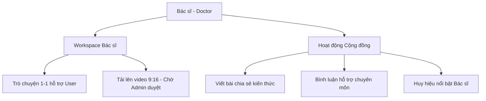

# Kế Hoạch Tính Năng & Thiết Kế — Vai Trò Bác Sĩ / Chuyên Gia (Doctor/Psychologist)

Tài liệu này đặc tả chi tiết các tính năng, giao diện làm việc và vai trò chuyên môn của **Bác sĩ/Chuyên gia tâm lý (Doctor/Psychologist)** trong hệ sinh thái web **An Nhiên**. Toàn bộ giao diện làm việc (UI/UX) được thiết kế thuần Việt để tạo sự gần gũi, chỉ riêng phần lưu trữ cơ sở dữ liệu (Database) là sử dụng tiếng Anh.

---

## 1. Không Gian Làm Việc Của Bác Sĩ (Workspace Bác sĩ)

Trang chủ của Bác sĩ được thiết kế như một bảng điều khiển (Dashboard) kết hợp giữa hỗ trợ tham vấn và sáng tạo nội dung trên Web, loại bỏ hoàn toàn các cơ chế thu phí y tế và tính năng cá nhân để **tập trung vào chuyên môn**:

### 💬 Trò chuyện hỗ trợ 1-1
*   **Nhiệm vụ**: Trò chuyện tham vấn chuyên sâu 1-1 với những người dùng có yêu cầu gặp Bác sĩ y khoa (hoặc các ca nặng do Người đồng hành chuyển tiếp).
*   **Giao diện**: Khung chat 1-1 chuyên dụng hiển thị danh sách các cuộc hội thoại được phân bổ. Bác sĩ có thể xem tóm tắt tâm lý của bệnh nhân (AI Insights) trước khi nhắn tin để nắm bắt tình hình nhanh chóng.
*   **Không thu phí**: Luồng chat này hoàn toàn miễn phí, dựa trên tinh thần hỗ trợ cộng đồng và chia sẻ trách nhiệm xã hội.

### ✍️ Sáng tạo Video ngắn Chữa lành
*   **Nhiệm vụ**: Cung cấp kiến thức tâm lý chính thống dưới dạng trực quan sinh động.
*   **Giao diện**: Trình tải lên video ngắn 9:16 (Shorts/Reels dưới 60 giây).
*   **Quy trình kiểm duyệt**: Video sau khi tải lên sẽ ở trạng thái **`Chờ duyệt` (Pending)** và chỉ chính thức xuất hiện trên *Trạm Chữa Lành* của người dùng sau khi được **Admin** kiểm duyệt và phê duyệt hiển thị.

---

## 2. Vai Trò Trên Cộng Đồng & Định Hướng Chuyên Môn

### 👥 Hoạt động định hướng trên Cộng đồng ẩn danh
*   Bác sĩ viết bài chia sẻ và bình luận hỗ trợ dưới các tâm sự của người dùng.
*   Bên cạnh tên hiển thị của Bác sĩ luôn hiển thị huy hiệu nổi bật **`[Bác sĩ]`** để khẳng định tính chính thống và xây dựng lòng tin tuyệt đối cho người dùng.

---

## 3. Các Giới Hạn Nghiệp Vụ (Out of Scope for MVP)
Để tối ưu hóa tài nguyên cho Hackathon, vai trò Bác sĩ sẽ **không tham gia vào các luồng sau**:
*   ❌ Không làm công việc kiểm duyệt nội dung cộng đồng hay duyệt các ca bị báo cáo/gắn cờ (nhiệm vụ này thuộc về vai trò **Admin**).
*   ❌ Không có hệ thống bệnh án điện tử phức tạp, ghi chú lâm sàng mã hóa rườm rà hay các cổng thanh toán y tế.
