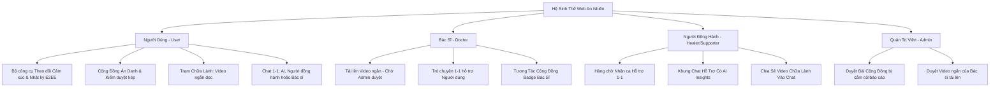
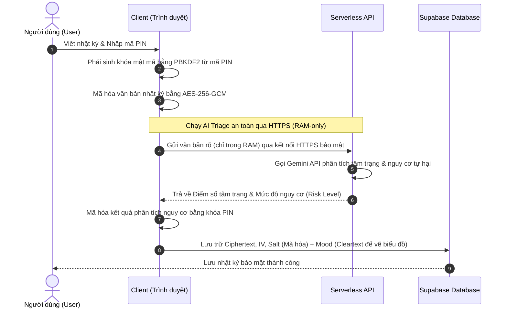
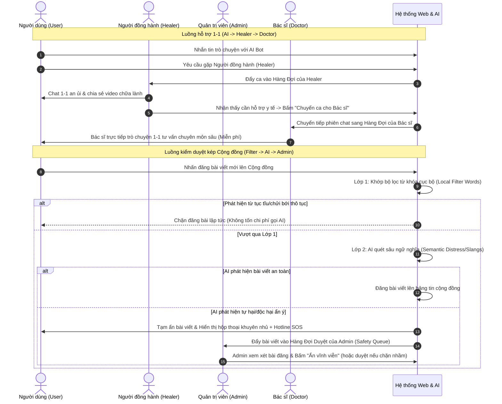

# Kế Hoạch Phát Triển Tính Năng & Kiến Trúc Hệ Thống — Ứng Dụng Web "An Nhiên"

Tài liệu này tổng hợp toàn bộ các tính năng cốt lõi và kiến trúc hệ thống của ứng dụng web chăm sóc sức khỏe tinh thần **An Nhiên**, được thiết kế tối ưu cho cuộc thi Hackathon dưới dạng một ứng dụng **Web Responsive** có tính khả thi cao. Toàn bộ giao diện người dùng (UI/UX) được thiết kế thuần Việt để tăng tính gần gũi, chỉ riêng phần cơ sở dữ liệu (Database) và cấu trúc biến backend sử dụng tiếng Anh để tối ưu kỹ thuật.

---

## 1. Bản Đồ Tính Năng Theo Vai Trò (Simplified Multi-role Map)

Hệ thống được thiết kế đồng bộ trên nền tảng Web với **4 vai trò (Roles)** rõ ràng, mỗi vai trò tập trung vào một nhiệm vụ cốt lõi:

### 🧑‍💼 A. Người Dùng (User) — Trải nghiệm Chữa lành & Bảo mật Tuyệt đối
*   **Bộ công cụ Theo dõi Cảm xúc**: Đánh giá cảm xúc hàng ngày nhanh bằng 5 mức độ biểu cảm.
*   **Sổ tay Nhật ký bảo mật mã hóa đầu cuối (E2EE)**: 
    *   Nội dung nhật ký được mã hóa bằng thuật toán **AES-256-GCM** trực tiếp trên thiết bị (client) bằng khóa phái sinh từ **mã PIN** của người dùng.
    *   Chỉ có nhãn cảm xúc (`mood` trong database) được lưu trữ dạng rõ để phục vụ vẽ biểu đồ cảm xúc trên giao diện Hồ sơ.
*   **Trạm Chữa Lành**: Bảng tin video ngắn dọc 9:16 (Shorts/Reels) đã được phê duyệt giúp giảm stress, học tập, thư giãn tâm trí trực quan.
*   **Cộng đồng ẩn danh**: Đăng bài ẩn danh, chia sẻ tâm sự, được bảo vệ bởi **Hệ thống Kiểm duyệt kép (Bộ lọc từ khóa + AI + Admin)**.
*   **Khung Chat 1-1**: Chat với AI Bot, hoặc kết nối trực tiếp với Người đồng hành (người thật) hoặc yêu cầu tư vấn chuyên sâu miễn phí từ Bác sĩ.

### 🌿 B. Người Đồng Hành (Healer) — Trực ca & Trợ giúp 1-1
*   **Trang chủ tối giản**: Chỉ tập trung vào nhiệm vụ hỗ trợ:
    *   **Trạng thái hoạt động**: Sẵn sàng (Available) | Bận (Busy) | Ngoại tuyến (Offline).
    *   **Hàng chờ nhận ca**: Danh sách người dùng đang chờ được hỗ trợ kèm tóm tắt tâm trạng nhanh do AI phân tích.
    *   **Khung Chat hỗ trợ**: Chat 1-1 với người dùng, tích hợp nút chia sẻ nhanh các video ngắn từ Trạm Chữa Lành, nút hướng dẫn SOS Khẩn cấp và **nút chuyển ca cho Bác sĩ** khi gặp ca khó.

### 🩺 C. Bác Sĩ / Chuyên Gia (Doctor) — Định hướng Chuyên môn & Trực tiếp hỗ trợ
*   **Trang chủ tối giản**: Không làm việc kiểm duyệt, chỉ tập trung vào:
    *   **Trò chuyện hỗ trợ 1-1**: Trực tiếp nhận và trò chuyện tham vấn chuyên môn sâu 1-1 với người dùng khi được yêu cầu hoặc chuyển tiếp từ Người đồng hành (không thu phí).
    *   **Quản lý nội dung**: Tải lên video ngắn dọc 9:16 (Shorts/Reels) chia sẻ bài tập thở, thiền chánh niệm nhanh hoặc kiến thức tâm lý. Các video này sẽ ở trạng thái chờ duyệt trước khi được xuất bản.
    *   **Định danh uy tín**: Tham gia cộng đồng để giải đáp, bình luận nâng đỡ người dùng với huy hiệu đặc quyền `[Bác sĩ]`.

### 🛡️ D. Quản Trị Viên (Admin) — Kiểm duyệt & Vận hành
*   **Trang chủ tối giản**: Tập trung 100% vào việc kiểm duyệt và đảm bảo tính an toàn:
    *   **Kiểm duyệt Cộng đồng**: Xem xét toàn bộ các bài đăng hoặc bình luận bị AI Auto-Moderator cắm cờ hoặc bị báo cáo vi phạm. Admin có quyền chọn `Phê duyệt hiển thị` hoặc `Ẩn bài viết`.
    *   **Kiểm duyệt Khám phá**: Xem xét các video ngắn do Bác sĩ tải lên. Admin duyệt thì video mới chính thức xuất hiện trên Trạm Chữa Lành của User.

---

## 2. Sơ Đồ Quy Trình Tuần Tự

### 2.1. Luồng Viết Nhật Ký Mã Hóa E2EE & Phân Tích AI Triage
Sơ đồ dưới đây mô tả cách nhật ký được bảo mật bằng mã hóa trên thiết bị của người dùng, nhưng vẫn chạy được phân tích AI Triage một cách an toàn:

### 2.2. Luồng Kiểm Duyệt Kép Cộng Đồng & Luồng Chat 1-1
Sơ đồ dưới đây mô tả sự tương tác mượt mà giữa các thực thể thông qua hệ thống kiểm duyệt 2 lớp và thời gian thực của An Nhiên:

---

## 3. Chiến Lược Tái Sử Dụng Thành Phần Trên Nền Tảng Web (Web Component Reuse)

Để tối ưu hóa tốc độ lập trình trong 48 giờ thi Hackathon, các thành phần giao diện (UI Components) được thiết kế theo hướng đa hình (Polymorphic) và tái sử dụng tối đa:

| Thành Phần UI | Vai trò: Người Dùng (User) | Vai trò: Đồng Hành (Healer) | Vai trò: Bác Sĩ (Doctor) | Vai trò: Admin | Giải Pháp Tái Sử Dụng (Reuse) |
| :--- | :--- | :--- | :--- | :--- | :--- |
| **Khung Chat (Chat Interface)** | Trò chuyện 1-1 với AI Bot, Người đồng hành hoặc Bác sĩ. | Nhận ca và trò chuyện hỗ trợ 1-1 với User. | Trực tiếp nhận ca chuyển tiếp và trò chuyện hỗ trợ 1-1 với User. | *Không sử dụng* | **Tái sử dụng 90% UI**. Kế thừa toàn bộ giao diện bong bóng chat (bên trái/phải), thanh nhập liệu, biểu cảm. Healer/Doctor chỉ khác ở việc có thêm thanh hiển thị **AI Insights** về người dùng và nút chia sẻ video nhanh (hoặc nút chuyển ca đối với Healer). |
| **Trình xem Nhật ký (Journal Viewer)** | Viết nhật ký (giao diện sổ tay skeuomorphic), thực hiện **giải mã đầu cuối trên thiết bị** bằng mã PIN để xem lại lịch sử viết. | *Không sử dụng* (Đảm bảo quyền riêng tư tuyệt đối cho User). | *Không sử dụng* (Đảm bảo quyền riêng tư tuyệt đối cho User). | *Không sử dụng* (Đảm bảo quyền riêng tư tuyệt đối cho User). | **Tối mật 100%**. Thành phần này được cô lập hoàn toàn ở phía Client của User. Không phân quyền đọc cho bất kỳ vai trò nào khác kể cả Admin, chỉ truyền đi metadata `mood` để vẽ biểu đồ thống kê. |
| **Trình xem nội dung (Content Card / Video Player)** | Xem bảng tin video ngắn dọc 9:16 (Shorts/Reels) tại Trạm Chữa Lành. | Xem và lựa chọn nhanh video ngắn chữa lành để chia sẻ vào khung chat. | Quản lý danh sách video đã đăng, tải lên/xóa video. | Duyệt danh sách bài đăng cộng đồng bị báo cáo & Duyệt video của Bác sĩ. | **Tái sử dụng cấu trúc Card & Player**. Card nhận vào dữ liệu video (Tiêu đề, Tác giả, Video URL). Đối với User/Healer hiển thị dạng phát video, đối với Doctor bổ sung thêm các nút hành động đặc thù (Doctor có nút Xóa/Sửa). Admin tái sử dụng khung Card bài viết và Card video để thực hiện phê duyệt/ẩn. |

---

## 4. Kế Hoạch Hiện Thực Hóa MVP Cho Hackathon (Gợi ý 3 Giai Đoạn)

### Giai đoạn 1: Thiết lập Hệ thống Thiết kế & Giao diện Web (Design System & Shell)
*   **Trọng tâm**: Xây dựng khung giao diện Web Responsive với phong cách kính mờ (Glassmorphism) sang trọng.
*   **Mã hóa đầu cuối**: Tích hợp các hàm phái sinh khóa (PBKDF2) và mã hóa đối xứng (AES-256-GCM) sử dụng thư viện trình duyệt có sẵn **Web Crypto API** (nhẹ, không cần cài thư viện ngoài).

### Giai đoạn 2: Tích hợp Database Real-time & Luồng Chat 1-1 (Chat & Queue)
*   **Trọng tâm**: Sử dụng **Supabase Realtime** để kết nối khung chat. 
*   Xây dựng màn hình Hàng chờ của Người đồng hành và Bác sĩ. Người đồng hành nhấn nút nhận ca sẽ cập nhật trạng thái phòng chat sang `active` và mở khung chat 1-1.

### Giai đoạn 3: Tích hợp AI Triage & AI Auto-Moderator (AI Intelligence & Admin Panel)
*   **Trọng tâm**: Kết nối API Gemini 1.5 Flash thông qua serverless functions để phân tích bài viết nhật ký (phục vụ AI Triage chấm điểm PHQ-9 ẩn) và quét bài đăng cộng đồng trước khi đăng tải (AI Auto-Moderator).
*   Xây dựng màn hình kiểm duyệt kép cho Admin (Safety & Content Queue) để Admin phê duyệt bài đăng cộng đồng bị cắm cờ và kiểm duyệt video mới tải lên từ Bác sĩ.
