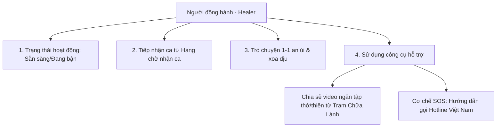

# Kế Hoạch Tính Năng & Thiết Kế — Vai Trò Người Đồng Hành (Healer/Supporter)

Tài liệu này đặc tả chi tiết toàn bộ các tính năng, giao diện làm việc và quy trình hỗ trợ dành riêng cho vai trò **Người đồng hành (Healer/Peer Supporter)** trong hệ sinh thái web **An Nhiên**. Toàn bộ giao diện làm việc (UI/UX) được thiết kế thuần Việt để tạo sự gần gũi, chỉ riêng phần cơ sở dữ liệu (Database) sử dụng tiếng Anh.

---

## 1. Không Gian Làm Việc Cốt Lõi (Workspace Người đồng hành)

Trang chủ của Người đồng hành được tối giản tối đa, loại bỏ hoàn toàn các tính năng cá nhân như Theo dõi cảm xúc hay Nhật ký cá nhân để **tập trung 100% vào nhiệm vụ hỗ trợ người dùng**. Giao diện được thiết kế dạng Bảng điều khiển (Dashboard) tối giản trên Web:

### 🟢 Quản lý Trạng thái Hoạt động
*   Nằm ở góc trên cùng thanh điều hướng, cho phép Người đồng hành chuyển đổi nhanh trạng thái làm việc (database sẽ lưu dưới dạng trường `status` tiếng Anh):
    1.  🟢 **Sẵn sàng (Available)**: Sẵn sàng nhận ca trò chuyện mới từ hàng chờ.
    2.  🟡 **Đang bận (Busy)**: Đang hỗ trợ sâu cho một ca, tạm thời không nhận ca mới.
    3.  🔴 **Ngoại tuyến (Offline)**: Đang nghỉ ngơi, ngắt kết nối khỏi hệ thống.

### 📥 Hàng chờ Nhận ca & Ca đang hỗ trợ
*   **Thiết kế chia đôi màn hình (Split-view)** tối ưu cho giao diện Web:
    *   **Cột bên trái**: Danh sách hàng chờ cuộc trò chuyện đang đợi (`Waiting Queue` trong database) và danh sách các ca đang hỗ trợ (`Active Chats` trong database).
    *   **Cột bên phải**: Khung chat chi tiết của ca đang được chọn.
*   **Thông tin hàng chờ**: Hiển thị thời gian chờ của người dùng và tóm tắt nhanh tâm trạng do AI phân tích ngầm (ví dụ: *"Người dùng đang lo lắng 😟 - Áp lực học tập"*).
*   **Hành động**: Người đồng hành nhấn nút **"Tiếp nhận"** để bắt đầu phiên trò chuyện 1-1.

---

## 2. Quy Trình Tương Tác & Công Cụ Hỗ Trợ Chat

### 💬 Trò chuyện an ủi 1-1
*   **Nhiệm vụ**: Lắng nghe, thấu cảm, xoa dịu các khủng hoảng tâm lý nhẹ (áp lực thi cử, gia đình, mối quan hệ) của người dùng khi họ yêu cầu gặp người thật từ luồng chat AI.
*   **Trải nghiệm chân thật**: Tương tác hoàn toàn bằng sự chân thành tự nhiên. Không lạm dụng tin nhắn mẫu tự động hay tóm tắt bằng AI trong cuộc trò chuyện để giữ kết nối con người ấm áp nhất.

### 🎥 Chia sẻ Video từ "Trạm Chữa Lành"
*   Ngay trong khung chat, Người đồng hành có một nút để duyệt nhanh danh mục các **Video ngắn** hướng dẫn (bài tập thở, chánh niệm) từ Trạm Chữa Lành.
*   Người đồng hành có thể gửi nhanh các video này dưới dạng thẻ phát video tương tác vào khung chat để người dùng theo dõi và thực hành hạ hỏa cảm xúc tại chỗ.

---

## 3. Vai Trò Trên Cộng Đồng & Cơ Chế An Toàn

### 👥 Tương tác trên Cộng đồng ẩn danh
*   Người đồng hành tham gia thảo luận trên bảng tin cộng đồng để lan tỏa năng lượng tích cực:
    *   **Đăng bài & Bình luận**: Chia sẻ các câu chuyện truyền cảm hứng (phải chọn chủ đề cụ thể).
    *   **Thả cảm xúc**: Bày tỏ sự đồng cảm qua các nút tương tác chữa lành (`🤗 Ôm`, `💛 Đồng cảm`, `🌿 Bình an`).
    *   **Huy hiệu nổi bật**: Bên cạnh tên ẩn danh của Healer luôn hiển thị huy hiệu vai trò **`[Người đồng hành]`** để tạo độ tin cậy cho cộng đồng.

### 🚨 Quy trình Chuyển ca & An toàn Khẩn cấp (SOS)
*   **Chuyển ca cho Bác sĩ**:
    *   Nếu Người đồng hành nhận thấy vấn đề của người dùng vượt quá khả năng lắng nghe thông thường và cần tư vấn y khoa chuyên sâu, Người đồng hành có thể nhấn nút **"Chuyển ca cho Bác sĩ"**.
    *   Hệ thống sẽ chuyển tiếp phiên chat sang hàng chờ của Bác sĩ để Bác sĩ vào tiếp nhận và tiếp tục trò chuyện 1-1 hỗ trợ người dùng.
*   **Quy trình khẩn cấp (SOS)**:
    *   Nếu người dùng có biểu hiện khủng hoảng cực độ hoặc ngôn từ tự hại:
        1.  Người đồng hành hướng dẫn người dùng sử dụng nút **SOS Khẩn cấp** trên màn hình để kết nối trực tiếp đến các hotline hỗ trợ khẩn cấp tại Việt Nam (Đường dây nóng Ngày Mai, Tổng đài 111).
        2.  Cung cấp bài tập thở chánh niệm tức thời để người dùng ổn định tâm trạng.
