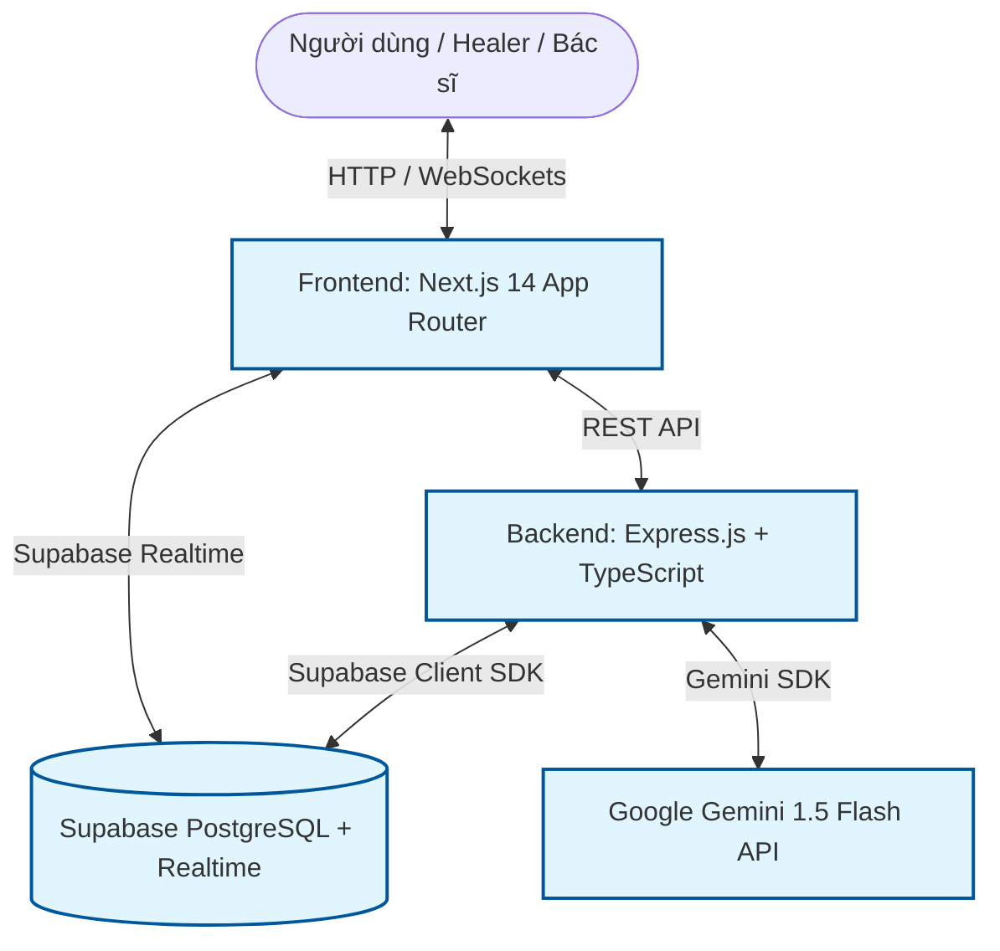

# Tài Liệu Kỹ Thuật & Triển Khai Hệ Thống (Tech Stack & Deployment Guide)

Tài liệu này đặc tả chi tiết kiến trúc kỹ thuật tách biệt Frontend/Backend, mô hình cơ sở dữ liệu PostgreSQL thực tế trên Supabase và quy trình triển khai ứng dụng **An Nhiên** tại cuộc thi Hackathon.

---

## 1. Kiến Trúc Hệ Thống Phân Tách (Frontend / Backend Architecture)

Để đảm bảo tính độc lập, khả năng mở rộng và mô phỏng chính xác môi trường dự án thực tế, hệ thống được thiết kế theo mô hình phân tách rõ ràng:



### 1.1. Lớp Giao diện (Frontend Layer) — `frontend/`
*   **Next.js 14 (App Router)**: Được viết bằng TypeScript, chịu trách nhiệm kết xuất giao diện phía Client (CSR/SSR).
*   **Tailwind CSS**: Thiết kế giao diện Glassmorphism mượt mà, phản hồi tốt trên cả Desktop và Mobile.
*   **Framer Motion**: Xử lý các hiệu ứng chuyển trang, lật thẻ sổ tay và animation vòng thở trị liệu.
*   **api-client.ts**: Fetch wrapper gọi API tới Backend (cổng 3001) đính kèm token JWT trong header.
*   **Supabase Client**: Chỉ dùng để thiết lập kết nối WebSocket (Supabase Realtime) lắng nghe tin nhắn chat trực tiếp phía client.

### 1.2. Lớp Máy chủ (Backend Layer) — `backend/`
*   **Express.js + TypeScript**: Xử lý toàn bộ logic nghiệp vụ (business logic) tại cổng 3001.
*   **Custom JWT Authentication**: Tự cấp và xác thực token JWT không cần thư viện ngoài (như Clerk hay Firebase) để tối ưu hóa thời gian phát triển.
*   **Supabase Service Role Client**: Kết nối trực tiếp tới PostgreSQL bằng Service Key để bỏ qua các lớp phân quyền RLS, ghi dữ liệu cực nhanh.
*   **Gemini AI SDK**: Gọi bảo mật tới mô hình `gemini-1.5-flash` để thực hiện AI Triage, AI Moderation và đóng vai các AI Personas.

---

## 2. Mô Hình Cơ Sở Dữ Liệu (Supabase PostgreSQL Schema)

Chúng ta thiết lập 7 bảng liên kết chặt chẽ trong Supabase. SQL script này có thể chạy trực tiếp trong mục **SQL Editor**:

```sql
-- Kích hoạt extension tạo UUID tự động
CREATE EXTENSION IF NOT EXISTS "uuid-ossp";

-- 1. Bảng users (Tất cả vai trò trong hệ thống)
CREATE TABLE users (
  id UUID PRIMARY KEY DEFAULT uuid_generate_v4(),
  nickname VARCHAR(50) NOT NULL,
  role VARCHAR(20) NOT NULL DEFAULT 'user', -- 'user', 'healer', 'doctor', 'admin'
  topics JSONB NOT NULL DEFAULT '[]'::jsonb, -- ['study', 'family', 'relationship', 'daily']
  created_at TIMESTAMPTZ NOT NULL DEFAULT NOW()
);

-- 2. Bảng journals (Lưu nhật ký đã mã hóa E2EE phía client)
CREATE TABLE journals (
  id UUID PRIMARY KEY DEFAULT uuid_generate_v4(),
  user_id UUID NOT NULL REFERENCES users(id) ON DELETE CASCADE,
  encrypted_content TEXT NOT NULL, -- btoa(plainText) phía client
  mood VARCHAR(20) NOT NULL, -- 'great', 'good', 'okay', 'tired', 'anxious'
  created_at TIMESTAMPTZ NOT NULL DEFAULT NOW()
);

-- 3. Bảng posts (Bài đăng chia sẻ ẩn danh của cộng đồng)
CREATE TABLE posts (
  id UUID PRIMARY KEY DEFAULT uuid_generate_v4(),
  author_id UUID NOT NULL REFERENCES users(id) ON DELETE CASCADE,
  content TEXT NOT NULL,
  topic VARCHAR(50) NOT NULL DEFAULT 'other',
  status VARCHAR(20) NOT NULL DEFAULT 'public', -- 'public', 'flagged', 'hidden'
  author_label VARCHAR(50) NOT NULL DEFAULT 'Ẩn danh',
  reactions JSONB NOT NULL DEFAULT '{"hug": 0, "empathy": 0, "peace": 0}'::jsonb,
  created_at TIMESTAMPTZ NOT NULL DEFAULT NOW()
);

-- 4. Bảng post_reactions (Bộ khóa tránh spam thả tim trùng lặp)
CREATE TABLE post_reactions (
  id UUID PRIMARY KEY DEFAULT uuid_generate_v4(),
  post_id UUID NOT NULL REFERENCES posts(id) ON DELETE CASCADE,
  user_id UUID NOT NULL REFERENCES users(id) ON DELETE CASCADE,
  reaction_type VARCHAR(20) NOT NULL, -- 'hug', 'empathy', 'peace'
  created_at TIMESTAMPTZ NOT NULL DEFAULT NOW(),
  UNIQUE(post_id, user_id)
);

-- 5. Bảng conversations (Phiên chat 1-1 hỗ trợ trực tiếp)
CREATE TABLE conversations (
  id UUID PRIMARY KEY DEFAULT uuid_generate_v4(),
  user_id UUID NOT NULL REFERENCES users(id) ON DELETE CASCADE,
  healer_id UUID REFERENCES users(id) ON DELETE SET NULL, -- NULL khi ở hàng đợi
  status VARCHAR(20) NOT NULL DEFAULT 'waiting', -- 'waiting', 'active', 'closed'
  ai_insights TEXT DEFAULT NULL, -- Tóm tắt nhanh cảm xúc của user do AI quét
  created_at TIMESTAMPTZ NOT NULL DEFAULT NOW()
);

-- 6. Bảng messages (Chi tiết tin nhắn trong cuộc hội thoại)
CREATE TABLE messages (
  id UUID PRIMARY KEY DEFAULT uuid_generate_v4(),
  conversation_id UUID NOT NULL REFERENCES conversations(id) ON DELETE CASCADE,
  sender_id UUID REFERENCES users(id) ON DELETE SET NULL, -- NULL đại diện hệ thống
  sender_role VARCHAR(20) NOT NULL, -- 'user', 'healer', 'ai', 'system'
  content TEXT NOT NULL,
  created_at TIMESTAMPTZ NOT NULL DEFAULT NOW()
);

-- 7. Bảng videos (Thư viện video ngắn của Bác sĩ)
CREATE TABLE videos (
  id UUID PRIMARY KEY DEFAULT uuid_generate_v4(),
  doctor_id UUID REFERENCES users(id) ON DELETE SET NULL,
  title VARCHAR(200) NOT NULL,
  topic VARCHAR(50) NOT NULL,
  video_url TEXT NOT NULL,
  description TEXT,
  status VARCHAR(20) NOT NULL DEFAULT 'approved',
  likes INTEGER NOT NULL DEFAULT 0,
  saved INTEGER NOT NULL DEFAULT 0,
  created_at TIMESTAMPTZ NOT NULL DEFAULT NOW()
);

-- Kích hoạt realtime cho các bảng chat
alter publication supabase_realtime add table conversations;
alter publication supabase_realtime add table messages;
```

---

## 3. Hướng Dẫn Triển Khai Lên Môi Trường Internet (Deployment Guide)

Do hệ thống tách biệt 2 folder độc lập, chúng ta tiến hành triển khai thành 2 dịch vụ riêng biệt.

### 🔌 Bước 1: Setup Cơ sở dữ liệu Supabase
1. Đăng nhập [Supabase](https://supabase.com), tạo một Project mới ở vị trí máy chủ gần nhất (Singapore).
2. Vào **SQL Editor**, chạy script tạo bảng ở phần 2 để khởi tạo cấu trúc dữ liệu.
3. Kích hoạt tính năng Realtime cho bảng `conversations` và `messages`.

### 🚀 Bước 2: Triển khai Backend Express lên Railway hoặc Render
1. Tạo một repo độc lập cho backend hoặc đẩy root lên GitHub.
2. Đăng ký tài khoản trên [Railway.app](https://railway.app) hoặc [Render.com](https://render.com).
3. Tạo dịch vụ mới -> Kết nối với repo GitHub chứa mã nguồn `backend/`.
4. Trong phần **Environment Variables**, cấu hình các khóa bảo mật sau:
   - `PORT` = `3001`
   - `JWT_SECRET` = `[Chuỗi_bí_mật_tự_chọn]`
   - `SUPABASE_URL` = `[URL_của_dự_án_Supabase]`
   - `SUPABASE_SERVICE_ROLE_KEY` = `[Service_role_key_an_toàn]`
   - `GEMINI_API_KEY` = `[Khóa_API_Gemini_lấy_từ_Google_AI_Studio]`
   - `FRONTEND_URL` = `https://[tên_miền_frontend_sau_khi_deploy].vercel.app`
5. Khởi động dịch vụ. Bạn sẽ nhận được đường dẫn API có giao thức bảo mật HTTPS (Ví dụ: `https://api-annhien.railway.app`).

### 🎨 Bước 3: Triển khai Frontend Next.js lên Vercel
1. Truy cập [Vercel.com](https://vercel.com), liên kết với tài khoản GitHub và chọn thư mục `frontend/`.
2. Thiết lập **Root Directory** của dự án là `frontend`.
3. Trong mục **Environment Variables**, cấu hình các khóa công khai sau:
   - `NEXT_PUBLIC_API_URL` = `https://api-annhien.railway.app` (Đường dẫn HTTPS vừa lấy từ bước 2)
   - `NEXT_PUBLIC_SUPABASE_URL` = `[URL_của_dự_án_Supabase]`
   - `NEXT_PUBLIC_SUPABASE_ANON_KEY` = `[Anon_key_an_toàn]`
4. Bấm **Deploy**. Vercel sẽ biên dịch ứng dụng và cấp cho bạn tên miền truy cập miễn phí (Ví dụ: `https://annhien.vercel.app`).
